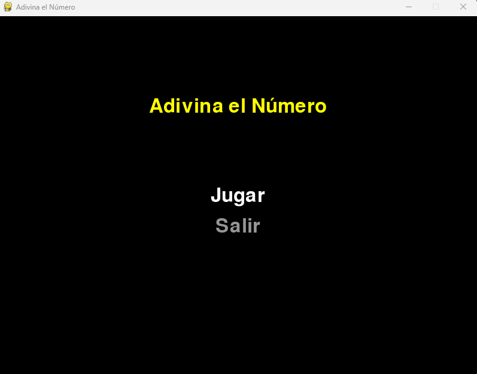
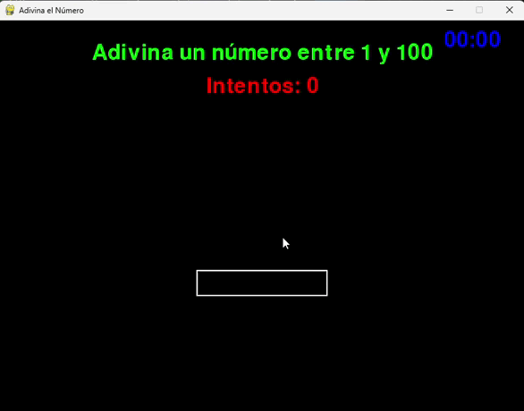

# Adivina el Número 

## Descripción

"Adivina el Número" es un juego interactivo desarrollado en Python utilizando la biblioteca Pygame. El jugador debe adivinar un número secreto entre 1 y 100 en la menor cantidad de intentos posible.

## Características

- Interfaz gráfica atractiva y fácil de usar
- Menú principal interactivo
- Sistema de pausa con opciones de reanudar, reiniciar y salir
- Contador de intentos
- Temporizador para medir el tiempo de juego
- Retroalimentación visual y textual para cada intento

## Capturas

### Menu principal

### Menu de pausa

### Juego

## Requisitos

- Python 3.x
- Pygame

## Cómo jugar

- Usa las teclas de flecha para navegar por los menús
- Presiona Enter para seleccionar una opción
- Ingresa números con el teclado y presiona Enter para hacer un intento
- Presiona Escape durante el juego para pausar

